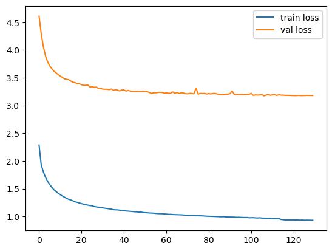

# Alien translator
Данная модель переводит текст с искусственного языка "Зетанов" на английский. Модель сделана в академических целях поэтому при разработке намерено не использовалось обогащение датасета и предобученные модели. С основными результатами работы можно ознакомиться в удобном формате из [ноутбука](https://www.kaggle.com/code/timofeychernikov/alien-notebook).

# Обзор репозитория 
- cleared-dataset: очищенная версия датасета.
- dataset: исследуемый датасет.
- generated_files: токены, веса обученной модели, перевод тестовой выборки.
- data_analysis.ipynb: ноутбук с разведывательным анализом данных.
- data.py: код для загрузки данных.
- models.py: модель и код для ее обучения и инференса.

# Обзор датасета
Датасет взят из третьей [домашней работы](https://contest.yandex.ru/contest/67637/problems/) Яндекс тренировок по ML 2.0. Датасет представляет собой пары формата текст - перевод, где текст это предложения на искусственном "языке Зетанов", а перевод на английском. Размер датасета - 300 000 объектов.

# Предобработка датасета
В ходе EDA было выяснено, что датасет имеет некоторое количество очевидно некачественных объектов. Из датасета были удалены объекты где предложение и перевод имели разные числа, удалены дубликаты и объекты где предложения и перевод сильно различались по длинне.

# Токенизация текстов
Для токенизации текстов на обоих языках использовался алгоритм WordPiece с ограничением на 3000 токенов. Данное число токенов выведено исходя из наблюдений за процессом обучения модели и просмотром полученного набора токенов.

# Модель
В качестве модели был выбран трансформер ввиду высокой производительности данной модели для переводов.

# Обучение и подобр гиперпараметров
В качестве функции потерь использовалась кросc-энтропия. Оптимизация проводилась с помощью алгоритма ADAM и простого планировщика learning rate.

В ходе обучения и подбора гиперпараметров очень остро стояла проблема переобучения. Приходилось очень аккуратно подбирать гиперпараметры чтобы модель не переобучалась. В итоге было решено сделать следующие гиперпараметры: 
```
D_MODEL = 216
N_HEAD = 6
NUM_ENCODER_LAYERS = 4
NUM_DECODER_LAYERS = 4
DIM_FEEDFORWARD = 864
DROPOUT = 0.1
```

График зависимости функции потерь на тренировочкной и тестовой выборках от эпохи:


# Инференс
Для инференса использовался алгоритм beam search с 10 бимами, показавший себя лучше жадного поиска или beam search'а с другим количеством бимов.

# Производительность модели и итог
На тестовом датасете модель показала BLEU 1.21, что является очень низким результатам для трансформера. Скорее всего такой результат связан с низким качеством изучаемого датасета.